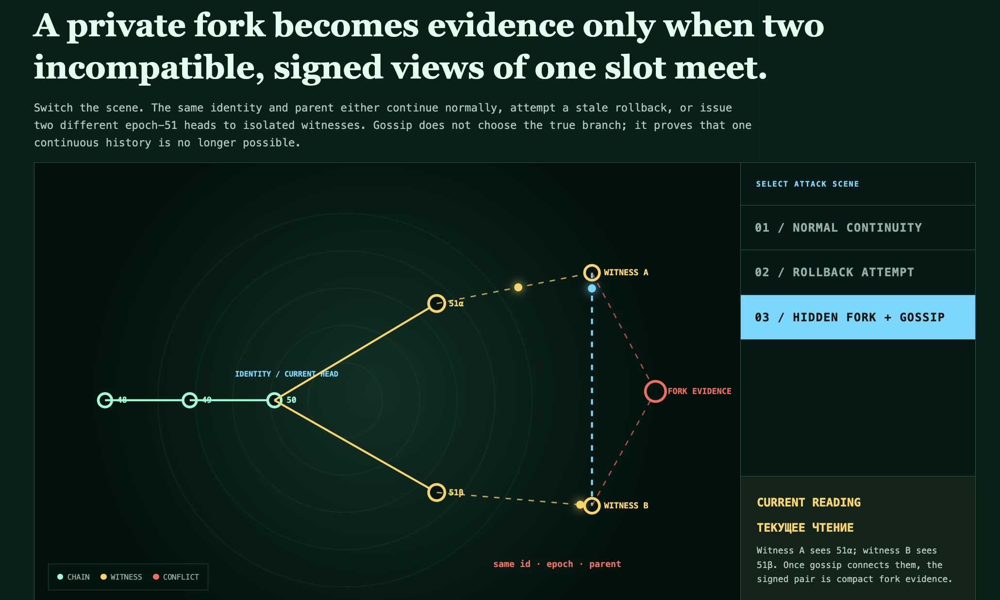

# CR-02 · Когда скрытая развилка становится доказательством

**Дата:** 2026-08-04<br>
**Статус:** рабочая исследовательская модель<br>
**Автор:** Салкуцан Алексей Анатольевич



## Русское чтение

Приватная развилка становится доказательством только тогда, когда встречаются два несовместимых подписанных представления одного шага.

Пока свидетель A видит только голову `51α`, а свидетель B только `51β`, каждый из них локально наблюдает допустимое продолжение. После gossip-обмена возникает компактная проверяемая пара: одна идентичность, один номер шага и один родитель, но две разные подписанные головы.

```text
Wₙ = (id, n, parentHead, head, σ)

Fork(Wᵃ, Wᵇ) ⇔
  sameSlot(Wᵃ, Wᵇ) ∧ headᵃ ≠ headᵇ
```

Gossip не выбирает «истинную» ветвь. Он доказывает более узкий и проверяемый факт: единая непрерывная история больше не согласуется со всеми полученными свидетельствами.

Это не новый шифр и не доказательство глобального обнаружения в полностью разделённой сети. Модель требует, чтобы хотя бы один честный свидетель увидел каждую ветвь, а канал между свидетелями когда-нибудь восстановился.

## English reading

A private fork becomes evidence only when two incompatible, signed views of one slot meet.

While witness A sees only head `51α` and witness B sees only `51β`, each locally observes an admissible continuation. Once gossip connects them, the pair becomes compact and verifiable: one identity, one slot and one parent, but two different signed heads.

Gossip does not choose the true branch. It proves the narrower claim that one continuous history is no longer compatible with all received evidence.

This is neither a new cipher nor a proof of global discovery in a permanently partitioned network. The model requires at least one honest witness to observe each branch and eventual reconnection between witnesses.

## Canonical artifacts / Канонические артефакты

- [Live CR-01/CR-02 reader / Живой ридер](https://chertogi-razuma-research.kernelpanic888.chatgpt.site/readers/certified-continuity-protocol/#cr02-map)
- [Exact visual source at commit `bb05467`](https://github.com/kernelpanic888/chertogi-razuma-research/blob/bb05467dca70ea010d97f9d73faf89b828d99faf/public/readers/certified-continuity-protocol/index.html)
- [Protocol, Lean and reference implementation repository](https://github.com/kernelpanic888/Salkutsan-Certified-Continuity-Protocol)
- [Release `sccp-v0.1.0`](https://github.com/kernelpanic888/Salkutsan-Certified-Continuity-Protocol/releases/tag/sccp-v0.1.0)

## Formal boundary / Формальная граница

CR-01 already contains a checked formal kernel and reference implementation in its dedicated repository. The CR-02 witness/gossip condition shown here is a visual working model and has not yet been closed as a Lean theorem.

CR-01 уже содержит проверенное формальное ядро и reference implementation в отдельном репозитории. Условие witness/gossip из CR-02 пока является визуальной рабочей моделью и ещё не закрыто как теорема Lean.

## Next passport step / Следующий шаг по паспорту

Freeze the mutation matrix and the honest-witness/eventual-connectivity assumptions before implementing executable gossip or claiming global fork detection.

Зафиксировать матрицу мутаций и допущения о честных свидетелях и восстановлении связности до реализации исполняемого gossip-механизма или заявления о глобальном обнаружении развилок.
